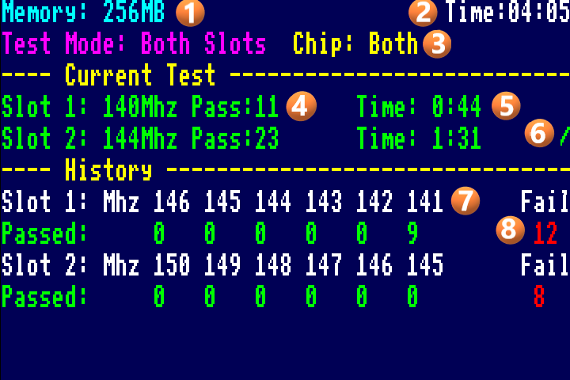

# MemTest256 - Dual SDRAM Memory Tester for MiSTer FPGA

Enhanced memory testing utility for MiSTer FPGA with dual SDRAM slot support, real-time text UI, and automated per-slot frequency characterization.

Built on [MiSTer-devel/MemTest_MiSTer](https://github.com/MiSTer-devel/MemTest_MiSTer) by Sorgelig.

## Features

- **Dual SDRAM support** — test both Slot 1 (GPIO 0) and Slot 2 (GPIO 1) without physically swapping modules
- **Smart startup** — auto-detects 256MB dual SDRAM and enters Both Slots mode; single module defaults to Slot 1 mode
- **Three test modes** — Both Slots (alternating), Slot 1 only, Slot 2 only — cycle with S key
- **Manual frequency control** — Up/Down arrows lock to a specific frequency for targeted testing
- **Auto resume** — A key re-enables auto stepping from current frequency without resetting to 167MHz
- **Real-time text display** — clean ASCII text UI with color-coded results and live activity feedback
- **Per-slot independence** — each slot has its own frequency, pass count, fail count, and timer
- **Chip select** — test Both chips, Chip 1 only, or Chip 2 only — cycle with C key
- **Frequency history** — per-slot history showing up to 6 tested frequencies with pass counts and total fails
- **Robust error handling** — dual watchdog system with retry escalation, per-slot error tracking
- **Two-phase frequency search** — coarse 10MHz steps up from 120MHz to find the band, then fine 1MHz steps to find the exact ceiling. Users see passes from the start.
- **1MHz frequency resolution** — full 1MHz steps from 60MHz to 167MHz for precise characterization
- **SDRAM2 auto-detection** — probes at 100MHz on boot for reliable hardware detection

## Display

### Color Coding
| Color | Meaning |
|-------|---------|
| **Cyan** | Memory size display |
| **Magenta** | Test mode display |
| **Yellow** | Chip select, separator lines, frequency blinking during test (after prior fail) |
| **Green** | Passing — frequency stable, pass count incrementing. Blinks during active test after prior pass |
| **Red** | Failing — errors detected at this frequency |
| **Orange** | Warning — passing but below 125MHz (marginal for MiSTer cores) |
| **White** | Labels, summary section |

### Screen Layout



1. **Memory** (cyan) — total detected memory: 32/64/128/256 MB
2. **Total Time** (white) — elapsed time since start, right-justified. Resets on mode switch or key press
3. **Test Mode** (magenta) and **Chip Select** (yellow) — current mode (Both Slots / Slot 1 / Slot 2) and chip filter (Both / 1 / 2)
4. **Current Test — Frequency and Pass Count** — frequency blinks while a test is in progress (yellow if first test or prior fail, green if prior pass). Once a pass completes, the line goes solid green showing "Pass:N" with the consecutive pass count. Resets to 0 on frequency change or failure
5. **Per-Slot Time** (green) — time spent at the current frequency for this slot. Resets when frequency changes
6. **Spinner** — animated indicator showing which slot is currently being tested
7. **History — Frequency** (white) — each column shows a frequency where testing occurred, most recent on the left. Up to 6 frequencies per slot
8. **History — Pass/Fail** — **Passed** (green) shows how many passes completed at each frequency before it failed. **Fail** (red) shows total frequency drops for this slot

### Color Guide
- **Frequency blinking yellow** — test in progress, prior test failed or first test
- **Frequency blinking green** — test in progress, prior test passed
- **Frequency solid green** — pass completed
- **Frequency solid red** — fail detected, showing "Failed"
- **Entire line orange** — passing but frequency below 125MHz (marginal for MiSTer cores)

### Error Display
- **Err1:NS Err2:NP** (red) — per-slot watchdog timeout counts. S = state machine timeout, P = progress timeout. Hidden when both are 0.

## Controls

### Keyboard
| Key | Action |
|-----|--------|
| **S** | Cycle test mode: Slot 1 → Slot 2 → Both Slots. Resets all counts. Deferred to clean pass boundary. |
| **P** | Toggle display between Slot 1 and Slot 2 view (Both Slots mode only) |
| **A** | Re-enable auto mode at current frequency. Clears all counts and timers. Use after Up/Down to "unlock". |
| **Up** | Increase frequency (manual/locked mode, disables auto stepping) |
| **Down** | Decrease frequency (manual/locked mode, disables auto stepping) |
| **Enter** | Reset current test at same frequency (stays in manual mode) |
| **C** | Switch chip select (Both → 1 → 2 → Both) |

### Gamepad
| Button | Action |
|--------|--------|
| Up/Down | Change frequency (manual mode) |
| A | Re-enable auto mode |
| Start | Reset test |
| B | Switch chip |
| Y | Switch slot/mode |
| X | Toggle view (peek) |

### Key Behavior Summary
- **Up/Down/C/Enter** — all reset counts, timers, summary, and error counters
- **S** — full mode switch with complete state reset
- **A** — re-enable auto from current position, clear counts but keep frequency

## How It Works

### Startup Sequence
1. Boot shows "MEMTEST256 / Detecting Memory..."
2. Probes Slot 2 at 100MHz — real RAM passes easily, empty slot fails instantly
3. If 256MB detected: enters Both Slots mode automatically
4. If 128MB only: enters Slot 1 mode
5. Testing begins with a two-phase frequency search starting at 120MHz

### Frequency Search
On startup, the tester finds each slot's maximum stable frequency using a two-phase approach:

**Phase 1 — Coarse (10MHz steps up):** 120 → 130 → 140 → 150 → 160 → 167. Each pass steps to the next decade. The first failure identifies the band.

**Phase 2 — Fine (1MHz steps down):** On first failure, drops one step and switches to normal downward auto-stepping (1MHz at a time) until a stable passing frequency is found. The tester then locks in and accumulates passes indefinitely.

### Test Cycle
Each test writes a pseudo-random LFSR pattern across the entire SDRAM address space, then reads it back comparing every 16-bit word. Any mismatch is a failure. One complete write/read cycle takes approximately 2 seconds at 150MHz.

### Both Slots Mode
Alternates testing between slots, characterizing both modules simultaneously. Default mode when 256MB (dual SDRAM) is detected.

1. Tests Slot 1 at its current frequency
2. After one pass, switches to Slot 2 at its own frequency
3. Each slot independently steps down frequency on failure
4. Both slots converge to their maximum stable frequency
5. Pass counts accumulate; frequency and counts reset on failure
6. PLL reconfigures on every slot switch with 50ms settling delay

### Single Slot Mode
- Tests only the selected slot continuously
- PLL only reconfigures when the frequency actually changes (on failure or key press)
- 50ms settling delay after PLL reconfiguration for stability
- 500ms pause on failure to show the red "Failed" result before continuing

### Manual/Locked Mode
- Up/Down arrows set a specific frequency and disable auto stepping
- Summary shows "Locked" instead of frequency
- Press **A** to re-enable auto stepping from current frequency

### Transaction State Machine
All test operations are serialized through a deterministic state machine:
```
START → WAIT_RECFG → WAIT_RESET_HI → WAIT_RESET_LO → SETTLE → WAIT_TEST → LATCH → [FAIL_DELAY] → DECIDE → START
```
- **passcount** only sampled in WAIT_TEST state
- **active_slot** only changed in DECIDE state
- All keys properly reset the state machine to prevent corruption
- Eliminates cross-clock domain issues between PLL clock and control clock

### Error Recovery
Two independent watchdog systems protect against hangs:

**State Machine Watchdog** (10.7 second timeout)
- Fires if PLL reconfiguration or SDRAM reset takes too long
- Retries same slot at same frequency
- After 5 consecutive timeouts: treats as failure, drops frequency

**Progress Watchdog** (10.7 second timeout)
- Fires if no test completes (pass or fail) for too long
- Same retry and escalation logic as state machine watchdog
- Catches scenarios where the state machine cycles but never completes

**Self-Healing**: Successful passes decrement the error counter. Transient glitches self-recover without user intervention.

### SDRAM2 Detection
On boot, probes Slot 2 at 100MHz:
- Real RAM passes easily at 100MHz → detected, shows 256MB
- No physical RAM → instant errors → not detected, single slot mode
- Uses SDRAM2_EN signal from MiSTer framework (MCP23009 I2C or SW[3] DIP switch)
- Inactive SDRAM controller held in reset with CS deselected to prevent power rail interference

## Building

Requires [Quartus Prime Lite Edition](https://www.intel.com/content/www/us/en/products/details/fpga/development-tools/quartus-prime/resource.html) with Cyclone V device support.

```
quartus_sh --flow compile MemTest256
```

Output: `output_files/MemTest256.rbf` — copy to MiSTer SD card as `/media/fat/_Utility/MemTest256.rbf`

**Quartus 25.x compatibility:** Copy PLL QIP files:
```
cp sys/pll_q17.qip sys/pll_q25.qip
cp rtl/vpll.17.qip rtl/vpll.25.qip
```

## Architecture

### Files
| File | Description |
|------|-------------|
| `MemTest256.sv` | Top-level MiSTer module, PLL management, transaction state machine, slot switching, watchdog |
| `rtl/tester.v` | Memory test engine — LFSR write/read/compare FSM |
| `rtl/sdram.v` | SDRAM controller with DDR clock, init sequence, auto-refresh. CS deselected when in reset. |
| `rtl/vgaout.v` | Text-based VGA display with bitmap font rendering, color-coded layout |
| `rtl/font_rom.v` | 8x8 bitmap font ROM for ASCII characters (A-Z, a-z, 0-9, symbols) |
| `rtl/bin2bcd.v` | Binary to BCD converters — 16-bit (5 digits) and 24-bit (7 digits) |
| `rtl/rnd_vec_gen.v` | LFSR pseudo-random pattern generator with save/restore |

### Key Design Decisions
- **Single tester with mux** — one tester instance alternates between SDRAM controllers via active_slot mux
- **Transaction state machine** — serialized test flow eliminates cross-clock domain issues
- **Deferred S key** — mode switches wait for clean pass boundary to prevent SDRAM corruption
- **Per-slot independent state** — frequency, pass count, fail count, timer all independent per slot
- **Cross-clock synchronization** — reset signal synchronized via 2-stage flip-flop, settling delay after PLL reconfig
- **Dual watchdog** — state machine + progress watchdogs with retry escalation and self-healing
- **Post-PLL settling delay** — 50ms for SDRAM stability after every frequency change
- **Two-phase frequency search** — coarse 10MHz steps up to find the band, then fine 1MHz steps to find exact ceiling

## Future Enhancements (v2 Architecture)

A next-generation architecture is being designed to address the limitations of the current alternating-slot approach. Key improvements planned:

### Sequential Slot Testing
Rather than alternating between slots every pass, the v2 architecture would fully characterize Slot 1 first (find its threshold, then deep validate), then move to Slot 2. This eliminates PLL cycling overhead between slot switches for faster convergence.

### Multiple Test Patterns
The current LFSR-only pattern may miss certain fault modes. Five complementary patterns are planned: Alternating (0xAA/0x55), Random (LFSR), Walking 1s, Checkerboard, and All On/All Off. Each tests different aspects of SDRAM timing and integrity.

### Per-Chip Fault Attribution
Since MiSTer SDRAM modules use data-width split configuration (Chip A = bits 0-15, Chip B = bits 16-31), errors can be attributed to specific chips by analyzing which bit positions fail, without requiring separate chip testing.

### Phase Delay Sweep
The Cyclone V PLL supports phase shifting with 156-417 picosecond resolution. By sweeping the clock phase at the threshold frequency, the actual setup/hold timing margin can be measured directly in picoseconds — providing richer characterization than frequency alone.

## Credits

- Based on [MemTest_MiSTer](https://github.com/MiSTer-devel/MemTest_MiSTer) by [Sorgelig](https://github.com/Sorgelig) — SDRAM controller (`rtl/sdram.v`), test engine (`rtl/tester.v`), random pattern generator (`rtl/rnd_vec_gen.v`), and PLL configuration originate from the original project
- Dual SDRAM support, text UI, transaction state machine, frequency history, and watchdog system by Ali Jani
- MiSTer FPGA framework (`sys/`) by the MiSTer community

## License

GNU General Public License v2.0 — see source files for details.
